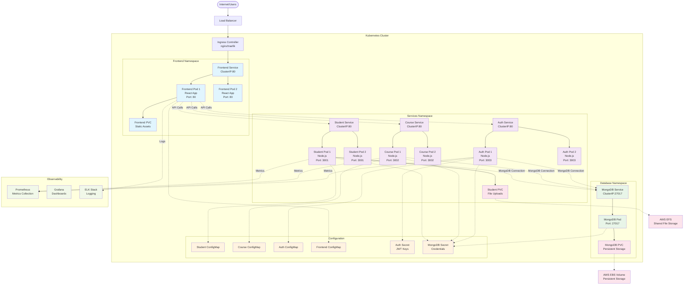
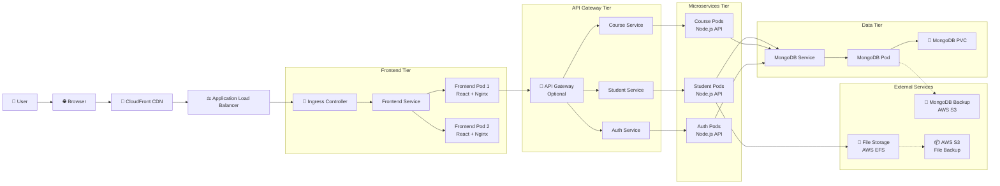
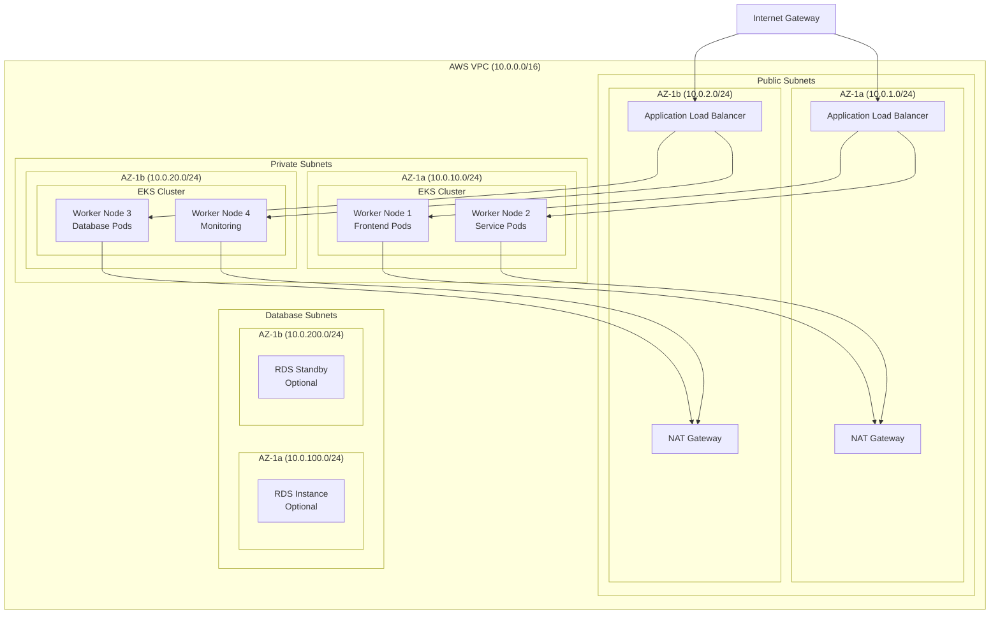
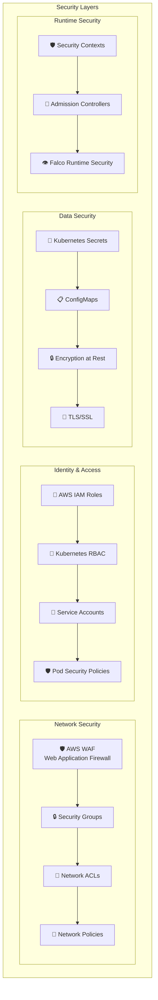

# SMS Application - Kubernetes Architecture Diagram

## High-Level Architecture Overview

## Detailed Component Architecture

## Network Architecture

## Security Architecture

## Deployment Strategy

```mermaid
graph LR
    %% CI/CD Pipeline
    subgraph "CI/CD Pipeline"
        GIT[📝 Git Repository] --> JENKINS[🔧 Jenkins/GitHub Actions]
        JENKINS --> BUILD[🏗️ Docker Build]
        BUILD --> TEST[🧪 Unit Tests]
        TEST --> SCAN[🔍 Security Scan]
        SCAN --> PUSH[📤 Push to Registry]
    end
    
    %% Deployment Stages
    subgraph "Deployment Stages"
        PUSH --> DEV[🧪 Development<br/>Namespace: dev]
        DEV --> STAGING[🎭 Staging<br/>Namespace: staging]
        STAGING --> PROD[🚀 Production<br/>Namespace: production]
    end
    
    %% Helm Deployment
    subgraph "Helm Deployment"
        PROD --> HELM[⚙️ Helm Charts]
        HELM --> K8S[☸️ Kubernetes Cluster]
        K8S --> MONITOR[📊 Monitoring & Alerts]
    end
```

## Resource Requirements

| Component | CPU Request | CPU Limit | Memory Request | Memory Limit | Replicas |
|-----------|-------------|-----------|----------------|--------------|----------|
| Frontend | 100m | 200m | 128Mi | 256Mi | 2-5 |
| Student Service | 250m | 500m | 256Mi | 512Mi | 2-10 |
| Course Service | 250m | 500m | 256Mi | 512Mi | 2-10 |
| Auth Service | 200m | 400m | 256Mi | 512Mi | 2-5 |
| MongoDB | 500m | 1000m | 1Gi | 2Gi | 1 |

## Storage Requirements

| Component | Storage Type | Size | Access Mode |
|-----------|-------------|------|-------------|
| MongoDB Data | AWS EBS (gp3) | 100Gi | ReadWriteOnce |
| Student Uploads | AWS EFS | 50Gi | ReadWriteMany |
| Application Logs | AWS EBS (gp3) | 20Gi | ReadWriteOnce |

This architecture provides:
- **High Availability**: Multi-AZ deployment with load balancing
- **Scalability**: Horizontal pod autoscaling based on metrics
- **Security**: Multiple security layers and best practices
- **Monitoring**: Comprehensive observability stack
- **Disaster Recovery**: Automated backups and multi-region support